# PR1-1: Instalación de un SGBD Oracle e informes

## ÍNDICE

1. [Instalación de Oracle](#1--instalación-de-oracle)
2. [Tablespace](#2--tablespace)
3. [Visualización de tablas del usuario sys](#3--visualización-de-tablas-del-usuario-sys)
4. [Usuarios](#4--usuarios)
5. [Informes Oracle](#5--informes-oracle)
6. [Archivos spool](#6--arhivos-spool)

 

### 1.- Instalación de Oracle

Para la instalación de Oracle, nos iremos a la página original de [descarga](https://www.oracle.com/es/database/technologies/xe-downloads.html)

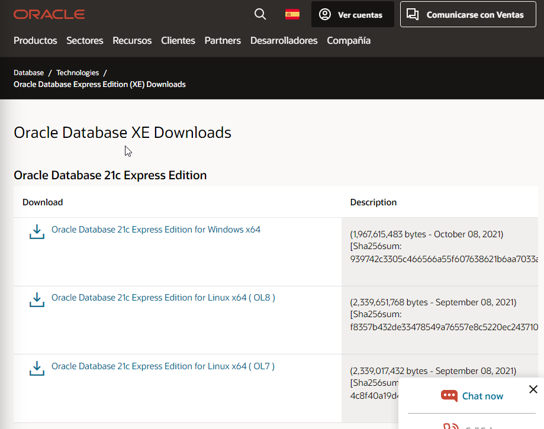

Abrimos el ejecutable:

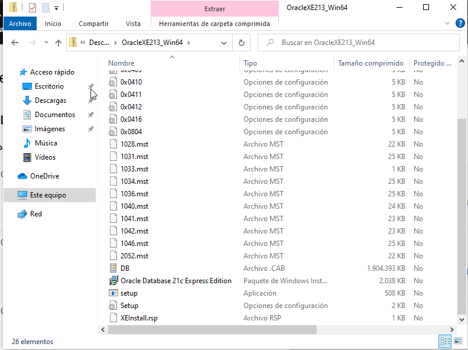

Una vez dentro, procederemos con la instalación:

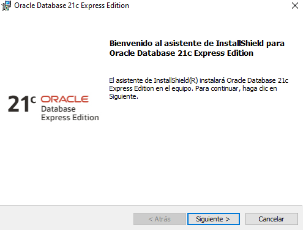

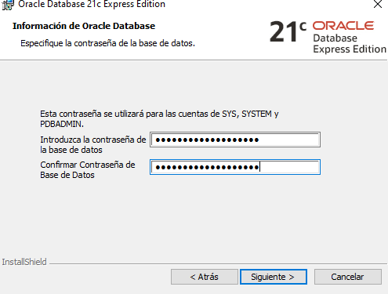

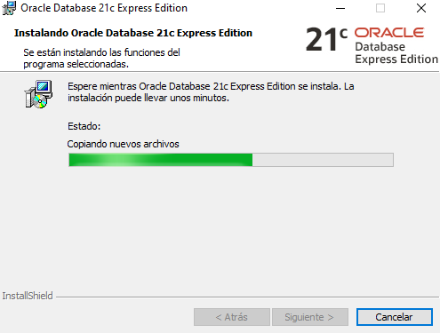

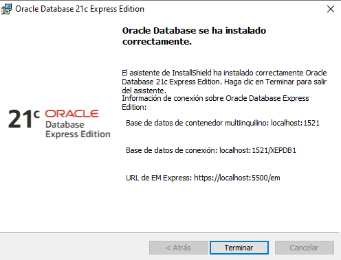

A continuación, nos dirigiremos en el siguiente [enlace](https://www.oracle.com/es/database/sqldeveloper/) para descargar "SQL Developer", la herramienta de oracle para gestionar las bases de datos.

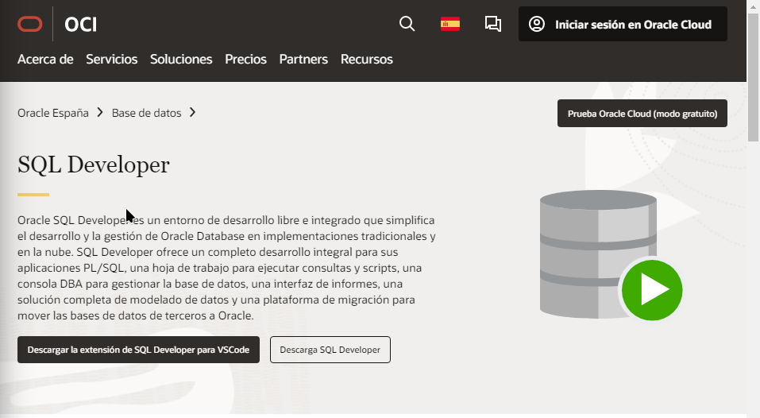

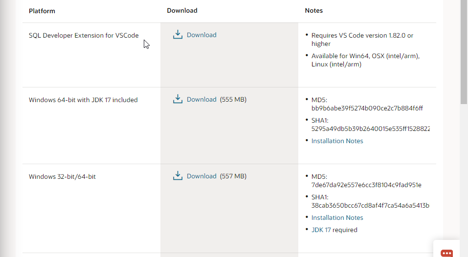

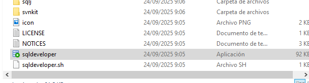

Crearemos la conexión con nuestra base de datos cuando "SQL Developer" esté ya instalado:

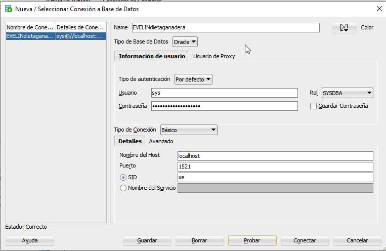

---
### 2.- Tablespace

En este paso crearemos dos tablespace de la siguiente manera:

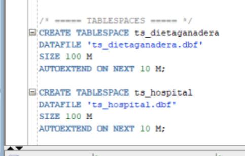

Y como podremos observar, en la inferior izquierda nos saldrá los nombres dde los tablespace creados:

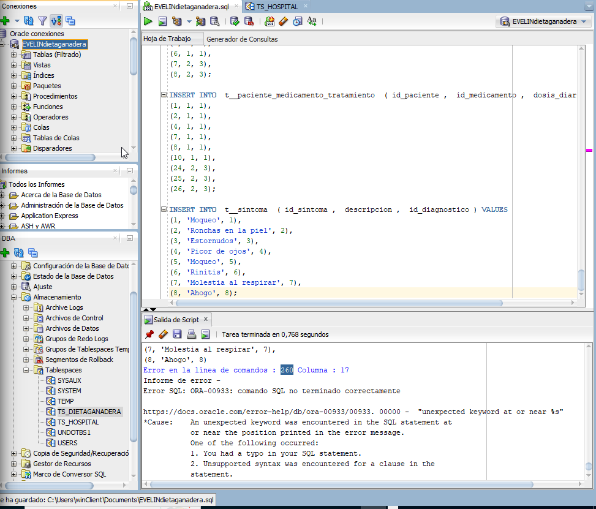

---
### 3.- Visualización de tablas del usuario sys

El primer paso sería crear las tablas respectivas:

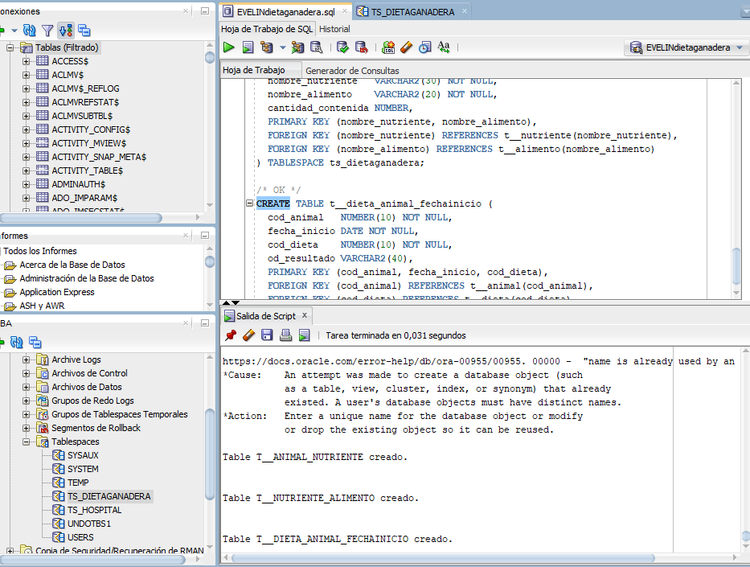

Una vez creadas, dentro del apartado "Conexiones" nos dirigimos a "Tablas". Allí podremos encontrar las tablas creadas:

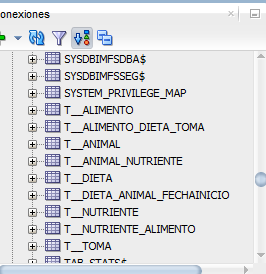

---
### 4.- Usuarios

Para crear los usuarios, en este caso, hemos creado un archivo sql exclusivo para crearlos y gestionarlos. Antes de todo debemos de asegurarnos que estamos en el contenedor correcto:

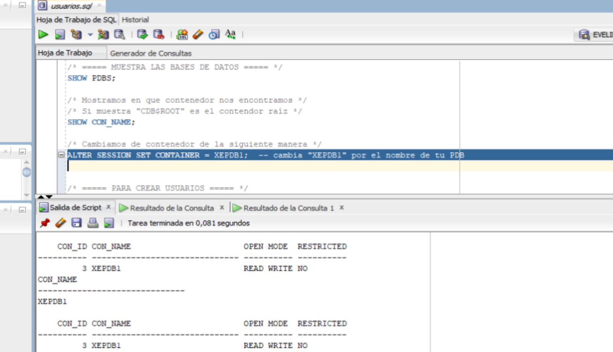

Una vez hemso cambiado nuestro contenedor, procederemos a crear los usuarios como en el siguiente ejemplo:

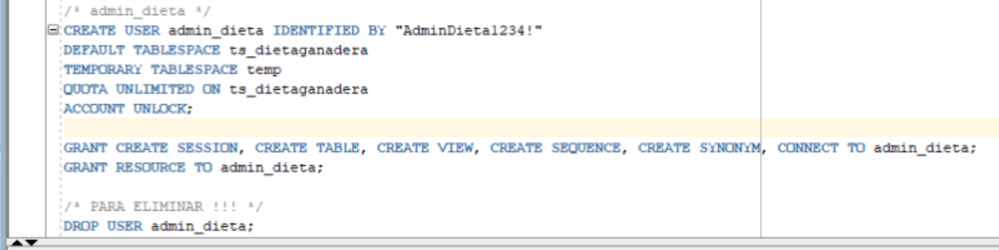

Seguimos añadiendo la conexión de cada usuario.

¡¡¡ OJO MUCHO CUIDADO !!!

Para que la conexión no de errores, debeis seleccionar la casilla  "Nombre del servicio" y escribir el nombre de nuestro contenedor como en el siguiente ejemplo:

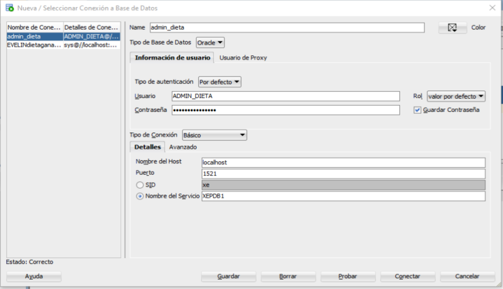

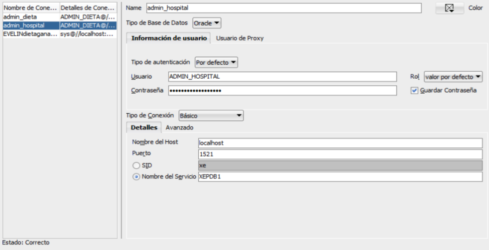

Ahora que tenemos los usuarios creados, necesitamos saber si vemos alguna tabla. Como es de esperar, no tenemos ninguna tabla en nuestro usuario por el momento.

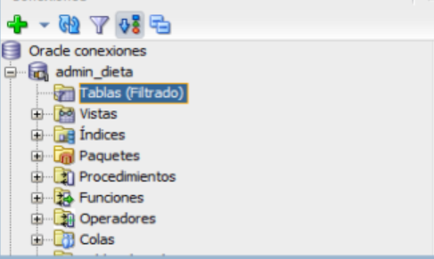

---
### 5.- Informes Oracle
Oracle genera varios informes de diagnóstico y rendimiento de forma automática o bajo demanda:

|Informe|Qué es|Donde se genera el script|Que contiene|
|-------|------|-------------------------|------------|
|AWR (Automatic Workload Repository)|Registro periódico de rendimiento de la BD|Script "awrrpt.sql" en "$ORACLE_HOME/rdbms/admin".|Carga del sistema, SQL más costosos, esperas, uso de CPU, I/O, etc.|
|ADDM (Automatic Database Diagnostic Monitor)|Analiza los datos de AWR y da recomendaciones.|Automático o vía "DBMS_ADVISOR".|Problemas detectados y sugerencias de mejora.|
|ASH (Active Session History)|Muestra sesiones activas en un periodo.|Script "ashrpt.sql".|Sesiones, eventos de espera, SQL activos.|
|Alert log y trace (ADR)|Registros de errores y eventos del sistema.|En "$ADR_BASE/diag/rdbms/<db_name>/<instancia>/trace/".|Errores ORA, inicios/paradas, incidentes, trazas.|

---
### 6.- Arhivos spool

El comando "spool" sirve para guardar en un archivo la salida de tus consultas o scripts en SQL*Plus o SQL Developer.

Como podremos ver en el siguiente ejemplo, se crearan archivos y se guardarán datos de consultas dentro de los mismos:

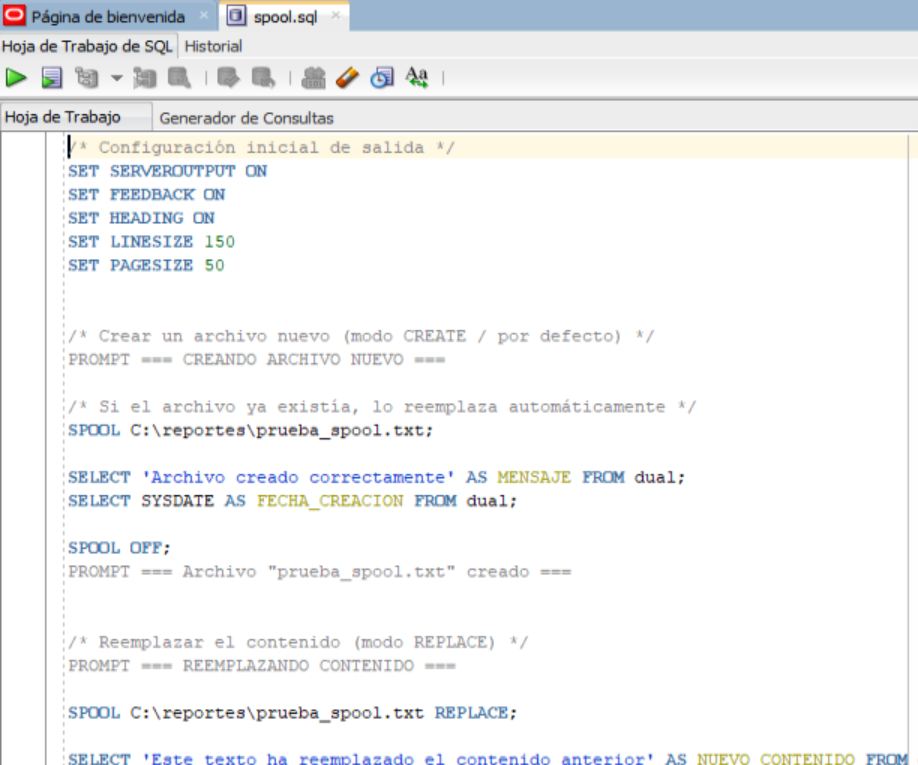

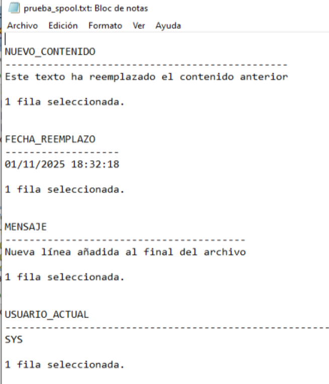