# RA06: BD Distribuida

## ÍNDICE

1. [Preparativos](#preparativos)
2. [Usuarios](#usuarios)
    - 2.1. [Tablespaces](#tablespaces)
    - 2.2. [Tabla y particiones](#tabla-y-particiones)
    - 2.3. [Creación de usuarios](#creación-de-usuarios)
3. [Archivos de configuración](#archivos-de-configuración)
    - 3.1. [sqlnet.ora](#sqlnetora)
    - 3.2. [tnsnames.ora](#tnsnamesora)
    - 3.3. [listener.ora](#listenerora)
4. [Conexión con usuarios remotos](#conexión-con-usuarios-remotos)
5. [Trigger](#trigger)
    - 5.1. [INSERT](#insert)
    - 5.2. [DELETE](#delete)
    - 5.3. [Comprobación desde otros usuarios vecinos](#comprobación-desde-otros-usuarios-vecinos)
6. [BD con los usuarios](#bd-con-los-usuarios)
    - 6.1. [Distribución de usuarios](#distribución-de-usuarios)


## Preparativos

En primer lugar, para poder empezar con la práctica, tendremos que crear un usuario **QUE NO TENGA EL ROL SYSDBA** y con todos los permisos posibles para que pueda crear tablas y triggers:

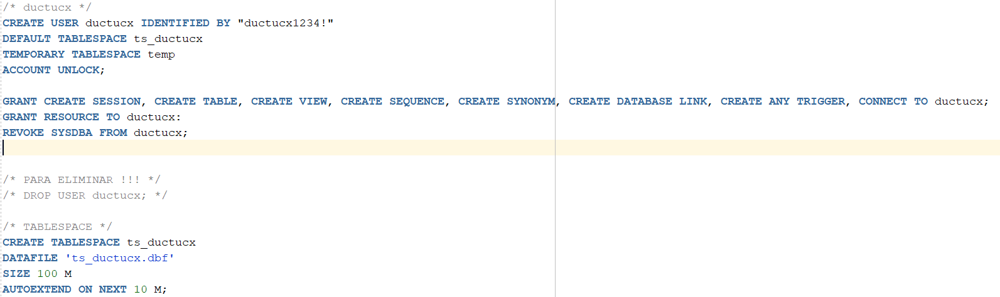

<div style="page-break-after: always;"></div>

Probaremos a hacer la conexión...

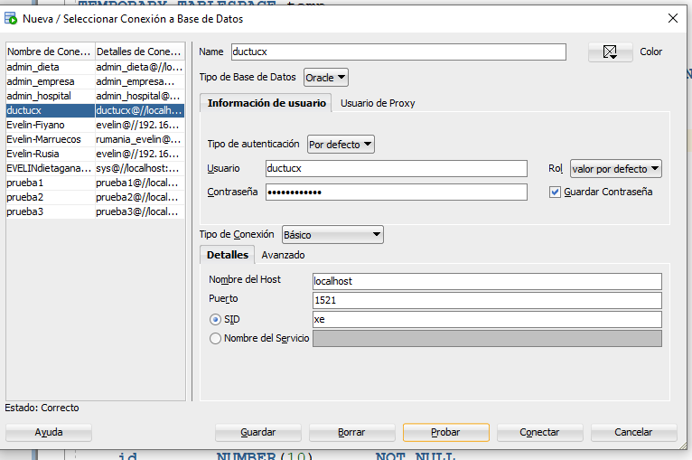


<div style="page-break-after: always;"></div>

## Usuarios

Ahora con nuestro usuario administrador que acabamos de crear, crearemos a nuestros respectivos usuarios de los vecinos correspondientes:

---
### Tablespaces

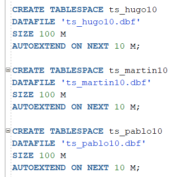

<div style="page-break-after: always;"></div>

---
### Tabla y particiones

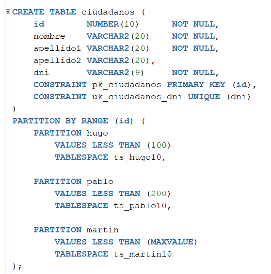

<div style="page-break-after: always;"></div>

---
### Creación de usuarios

Aqui nos encargaremos de crear los usuarios con sus respectivos "tablespaces".

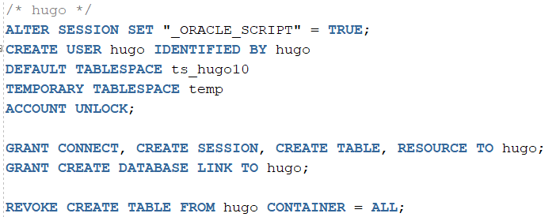


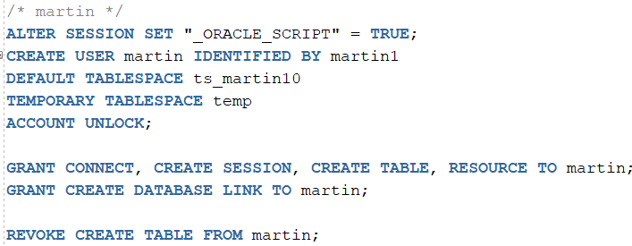

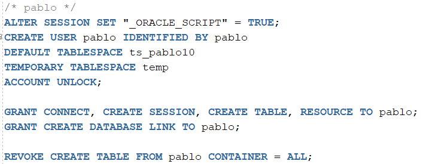

<div style="page-break-after: always;"></div>

## Archivos de configuración

### sqlnet.ora

En el archivo `sqlnet.ora` tendremos que añadir o modificar la siguiente línea:
`SQLNET.AUTHENTICATION_SERVICES = (NONE)`


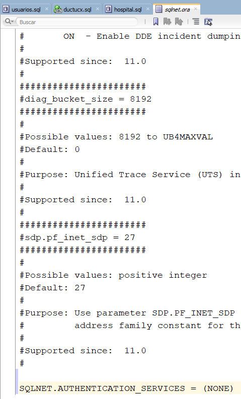

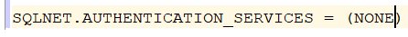

<div style="page-break-after: always;"></div>

--- 
### tnsnames.ora

Otro archivo que tendremos que cambiar es el `tnsnames.ora`, que tendremos que añadir las conexiones de nuestros vecinos para poder comunicarnos.

En el ejemplo tendremos que cambiar los nombres `ORCL_PROD` por uno que queramos asignar a nuestras conexiones, como por ejemplo `ORCL_<país>` .

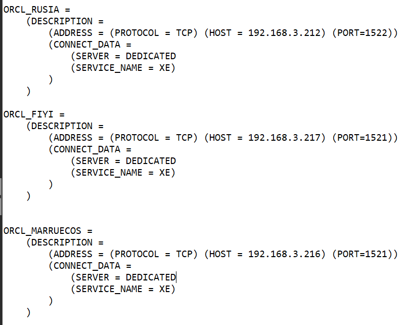

<div style="page-break-after: always;"></div>

---
### listener.ora

Y por último, nos aseguramos de que en `listener.ora` tengamos definido la IP y el puerto de nuestra máquina para que nuestros vecinos se puedan conectar.

Si nos fijamos bien encontraremos dos líneas muy importantes al final del fichereo:

```sql
...
    (ADDRESS = (PROTOCOL = TCP)(HOST = localhost)(PORT = 1521))
    (ADDRESS = (PROTOCOL = TCP)(HOST = 192.168.3.249)(PORT = 1521))
...
```

Tenemos que definir nuestro **localhost** y la **ip** en la que pueden otras máquinas encontrarnos.

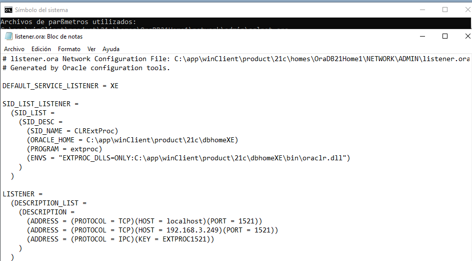

<div style="page-break-after: always;"></div>

Despues de hacer cualquier cambio en los ficheros de configuración, tendremos que reiniciar los servicios de Oracle para que aplique los nuevos cambios.

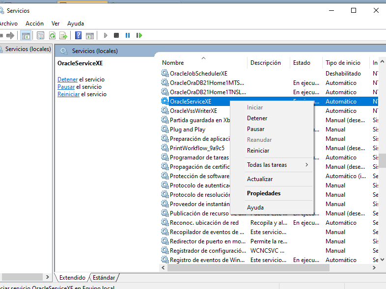

<div style="page-break-after: always;"></div>

Y ya finalmente los demás equipos podrán conectarse al nuestro, y si ellos han seguido los mismos pasos, debería de poder comunicar:

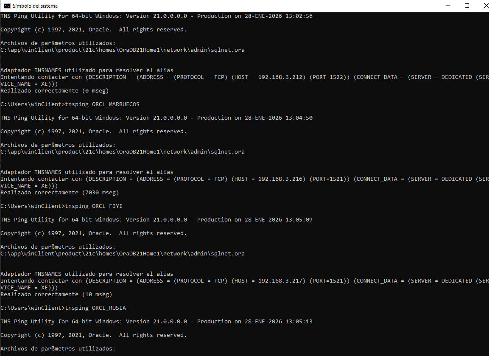

<div style="page-break-after: always;"></div>

## Conexión con usuarios remotos

Con las credenciales que nos han otorgado nuestros vecinos, probamos a hacer la conexión:

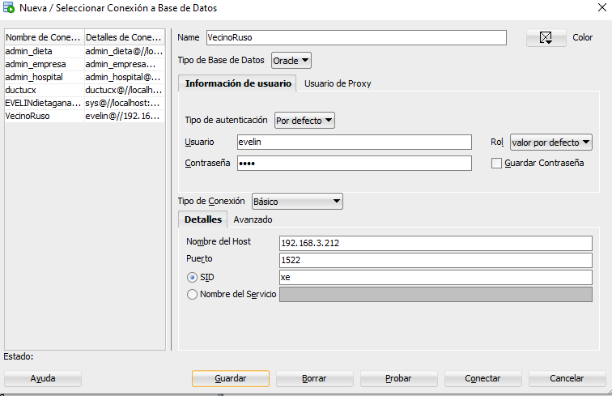

<div style="page-break-after: always;"></div>

Una vez que ingresemos dentro del usuario, podremos crear una tabla como ejemplo para verificar que se ha creado la partición correctamente. Una vez creada, el administrador de la base de datos nos tendrá que quitar los permisos para crear tablas:

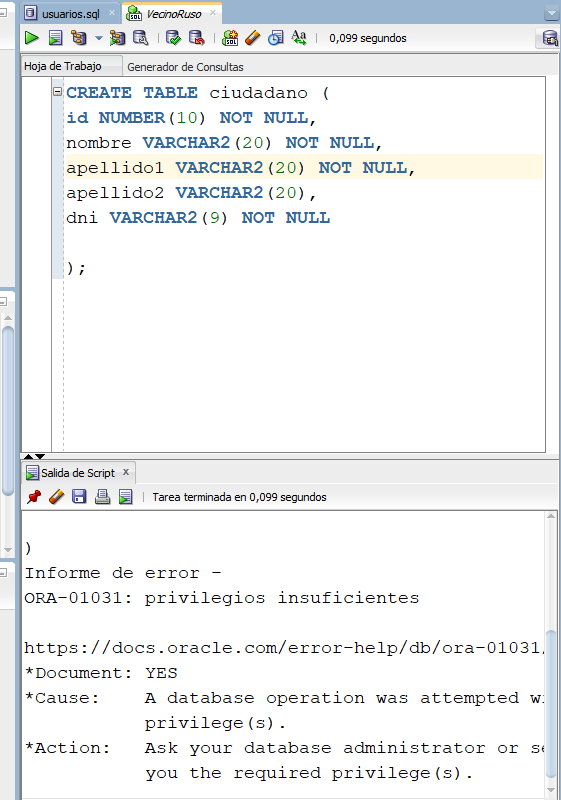

<div style="page-break-after: always;"></div>

Para comprobar la tabla creada (en el caso de que tengamos una), crearemos un dblink

Un **DBLINK** (Database Link) básicamente sirve para que una base de datos Oracle pueda acceder a otra base de datos Oracle remota como si fuera local.

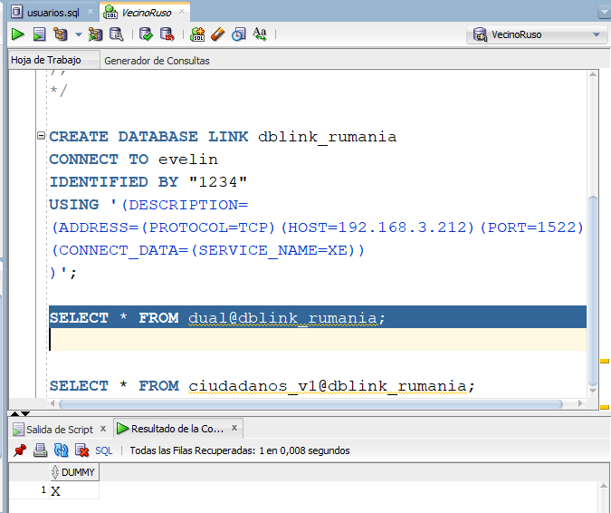


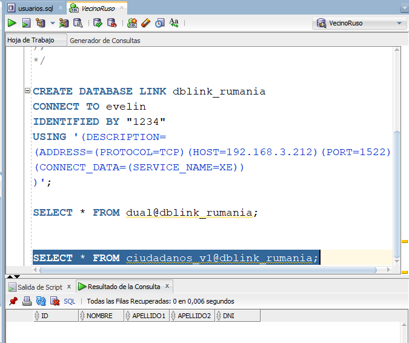

<b style="color: red;">¡¡¡ ATENCIÓN !!! ===> </b> En este ejemplo no muestra nada ya que la tabla ha sido eliminada y no encuentra datos, pero en la siguiente captura se muestra como mostrar los datos y comprobar que se ha creado en el tablespace correcto:

Pero para insertar los datos, dentro de nuestro usuario otorgado por el vecino, ejecutamos un `INSERT` y muy importante acabar con un `COMMIT`:

```sql
INSERT INTO <nombre_tabla>
VALUES (<id>, '<nombre>', '<apellido1>', '<apellido2>', '<dni>');
COMMIT;
```

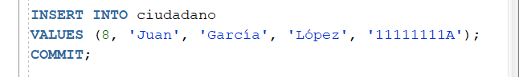


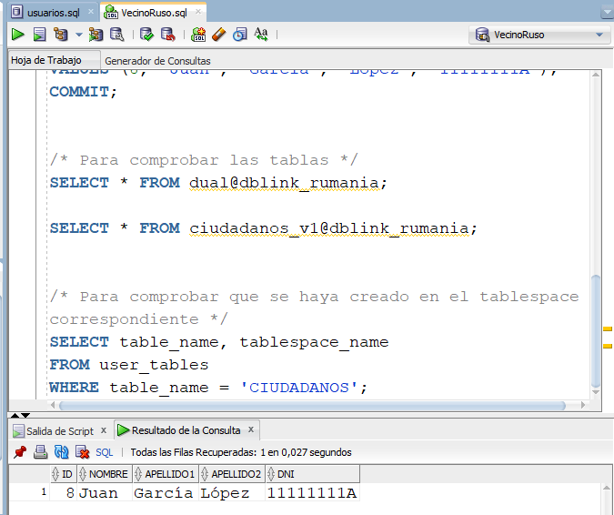

<div style="page-break-after: always;"></div>

De la siguiente manera podremos comprobar que se nos ha asignado el tablespace correcto:

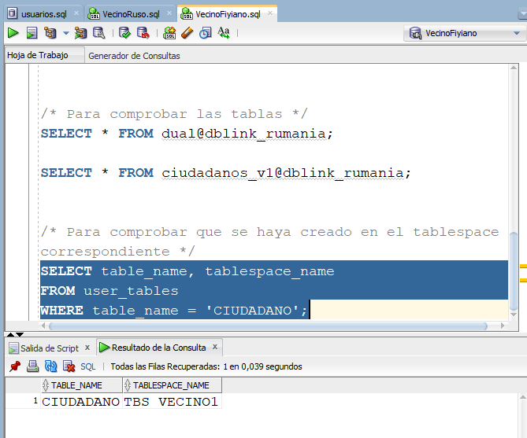

<div style="page-break-after: always;"></div>

Y como en este caso nosotros disponemos de 3 vecinos en total, tendremos que probar a hacer la conexión y seguir exactamente los mismos pasos con los otros usuarios:

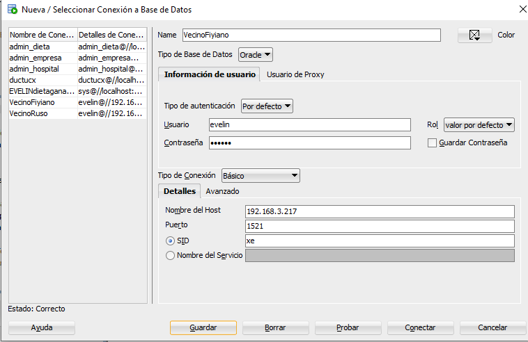

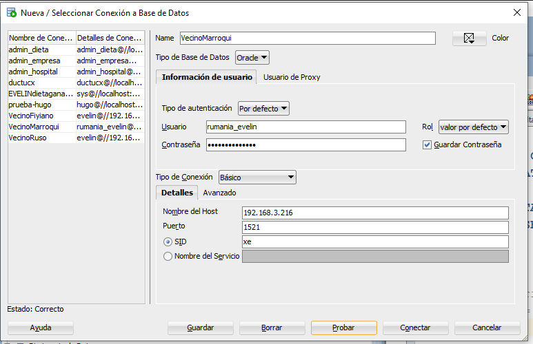

<div style="page-break-after: always;"></div>

Finalmente, gracias a los "dblinks" podremos consultar, crear o modificar las tablas sin ni si quiera entrar en el propio usuario otorgado por el vecino:

```sql
CREATE DATABASE LINK <nombre_link>
CONNECT TO <usuario>
IDENTIFIED BY <contraseña>
USING '<nombre_tnsname>';
```

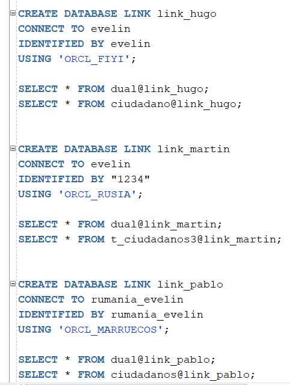


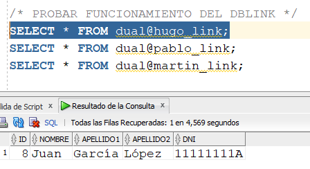

## Trigger

Con el siguiente trigger lograremos copiar las los INSERT, UPDATE y DELETE de nuestra tabla principal a las particionadas según el rango de su ID.

```sql
/* TRIGGER VERDADERO */
CREATE OR REPLACE TRIGGER trg_ciudadanos
AFTER INSERT OR UPDATE OR DELETE ON ciudadanos
FOR EACH ROW
BEGIN
    -- =========================
    -- INSERT
    -- =========================
    IF INSERTING THEN
        IF :NEW.id < 100 THEN
            INSERT INTO t_ciudadanos1@link_hugo
            VALUES (:NEW.id, :NEW.nombre, :NEW.apellido1, :NEW.apellido2, :NEW.dni);

        ELSIF :NEW.id < 200 THEN
            INSERT INTO t_ciudadanos2@link_pablo
            VALUES (:NEW.id, :NEW.nombre, :NEW.apellido1, :NEW.apellido2, :NEW.dni);

        ELSE
            INSERT INTO t_ciudadanos3@link_martin
            VALUES (:NEW.id, :NEW.nombre, :NEW.apellido1, :NEW.apellido2, :NEW.dni);
        END IF;

    -- =========================
    -- DELETE
    -- =========================
    ELSIF DELETING THEN
        IF :OLD.id < 100 THEN
            DELETE FROM t_ciudadanos1@link_hugo WHERE id = :OLD.id;

        ELSIF :OLD.id < 200 THEN
            DELETE FROM t_ciudadanos2@link_pablo WHERE id = :OLD.id;

        ELSE
            DELETE FROM t_ciudadanos3@link_martin WHERE id = :OLD.id;
        END IF;

    -- =========================
    -- UPDATE
    -- =========================
    ELSIF UPDATING THEN
        -- Si cambia el ID, movemos el registro
        IF :OLD.id != :NEW.id THEN
            -- borrar del origen
            IF :OLD.id < 100 THEN
                DELETE FROM t_ciudadanos1@link_hugo WHERE id = :OLD.id;
            ELSIF :OLD.id < 200 THEN
                DELETE FROM t_ciudadanos2@link_pablo WHERE id = :OLD.id;
            ELSE
                DELETE FROM t_ciudadanos3@link_martin WHERE id = :OLD.id;
            END IF;

            -- insertar en destino
            IF :NEW.id < 100 THEN
                INSERT INTO t_ciudadanos1@link_hugo
                VALUES (:NEW.id, :NEW.nombre, :NEW.apellido1, :NEW.apellido2, :NEW.dni);
            ELSIF :NEW.id < 200 THEN
                INSERT INTO t_ciudadanos2@link_pablo
                VALUES (:NEW.id, :NEW.nombre, :NEW.apellido1, :NEW.apellido2, :NEW.dni);
            ELSE
                INSERT INTO t_ciudadanos3@link_martin
                VALUES (:NEW.id, :NEW.nombre, :NEW.apellido1, :NEW.apellido2, :NEW.dni);
            END IF;

        ELSE
            -- mismo rango → solo UPDATE
            IF :NEW.id < 100 THEN
                UPDATE t_ciudadanos1@link_hugo
                SET nombre = :NEW.nombre,
                    apellido1 = :NEW.apellido1,
                    apellido2 = :NEW.apellido2,
                    dni = :NEW.dni
                WHERE id = :OLD.id;

            ELSIF :NEW.id < 200 THEN
                UPDATE t_ciudadanos2@link_pablo
                SET nombre = :NEW.nombre,
                    apellido1 = :NEW.apellido1,
                    apellido2 = :NEW.apellido2,
                    dni = :NEW.dni
                WHERE id = :OLD.id;

            ELSE
                UPDATE t_ciudadanos3@link_martin
                SET nombre = :NEW.nombre,
                    apellido1 = :NEW.apellido1,
                    apellido2 = :NEW.apellido2,
                    dni = :NEW.dni
                WHERE id = :OLD.id;
            END IF;
        END IF;
    END IF;
END;
/
```
---
### INSERT

Vamos a realizar algunas comprobaciones para asegurarnos de que el trigger funciona correctamente.

Como se ve en la siguiente captura, aqui tenemos algunas líneas para insertar, comprobar, actualizar y borrar datos de la tabla:

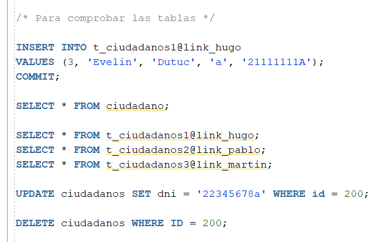

<div style="page-break-after: always;"></div>

Empezaremos insertando datos.

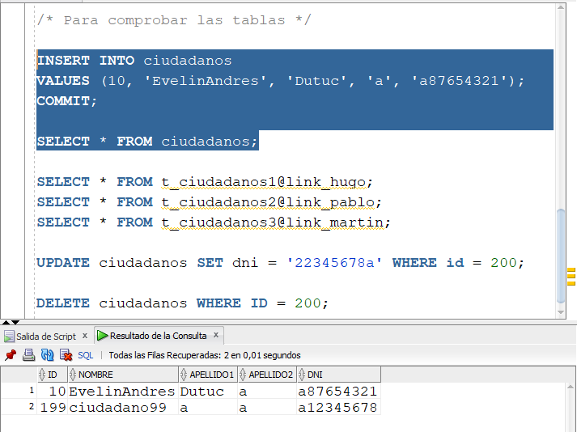

Ahora consultamos la base de datos del primer vecino (En este caso todos los ID's entre 1 y 99). Podremos ver que efectivamente se ha copiado la insercción:

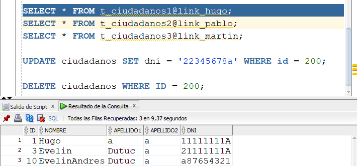

<div style="page-break-after: always;"></div>

---
### DELETE

Vamos a probar borrando la línea que hemos creado con anterioridad. La hemos borrado desde la tabla "ciudadanos", es decir, desde la tabla principal:

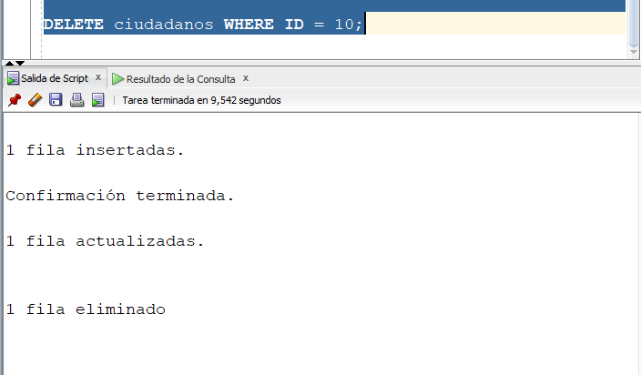

Consultamos con un `SELECT` a nuestro `DBLINK` para comprobar que se han aplicado los cambios.

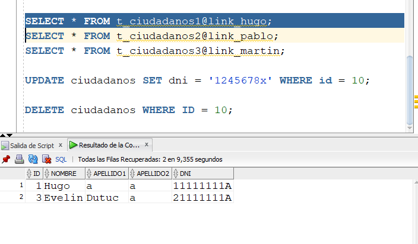

<div style="page-break-after: always;"></div>

---
### Comprobación desde otros usuarios vecinos

#### Con el usuario pablo (100 - 199)

En primer lugar insertamos la fila con el `id = 150`, aunque el id 100 y 199 también se ha seguido el mismo proceso.

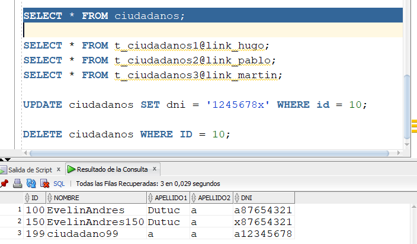

Si consultamos la tabla vecina:

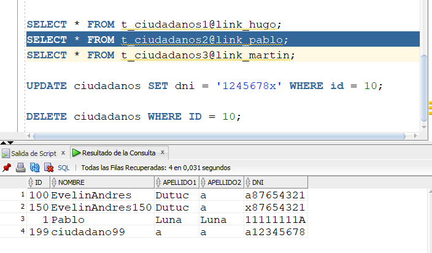

<div style="page-break-after: always;"></div>

#### Con el usuario martin (200 o más)

Insertamos con `id = 250`:

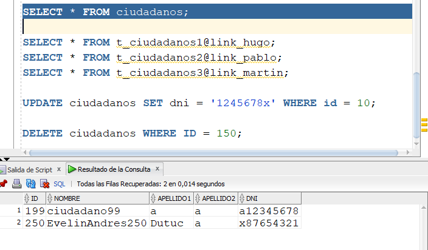

Y comprobamos:

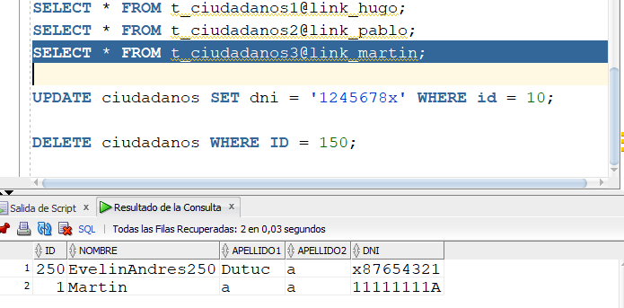

<div style="page-break-after: always;"></div>

## BD con los usuarios

Aquí están todos los usuarios creados:

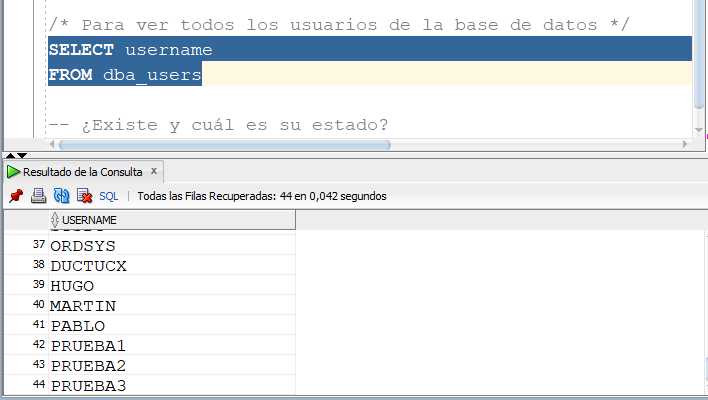


---
### Distribución de usuarios

#### Usuario local

- Ductucx

#### Usuarios de los vecinos

- hugo
- pablo
- martin