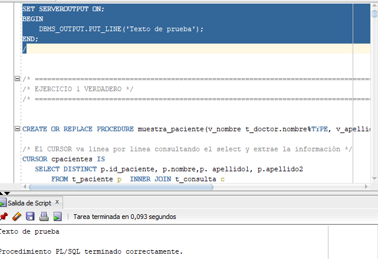
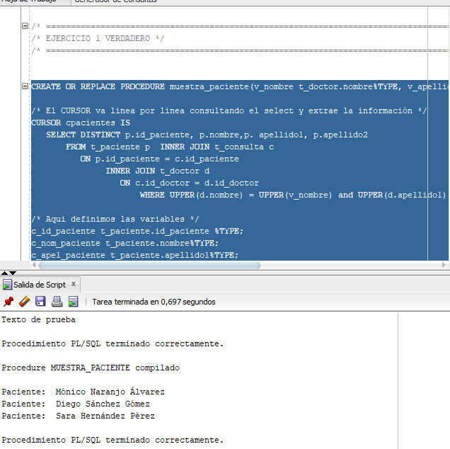
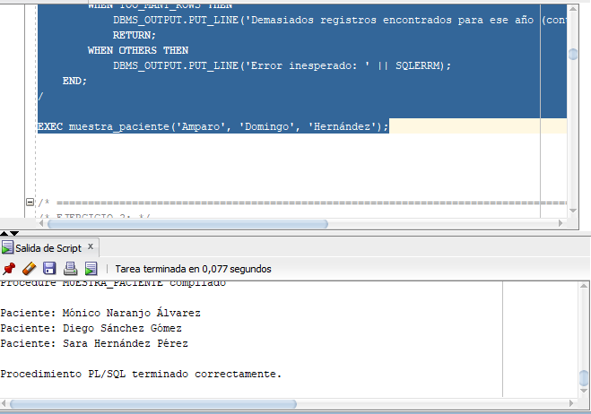
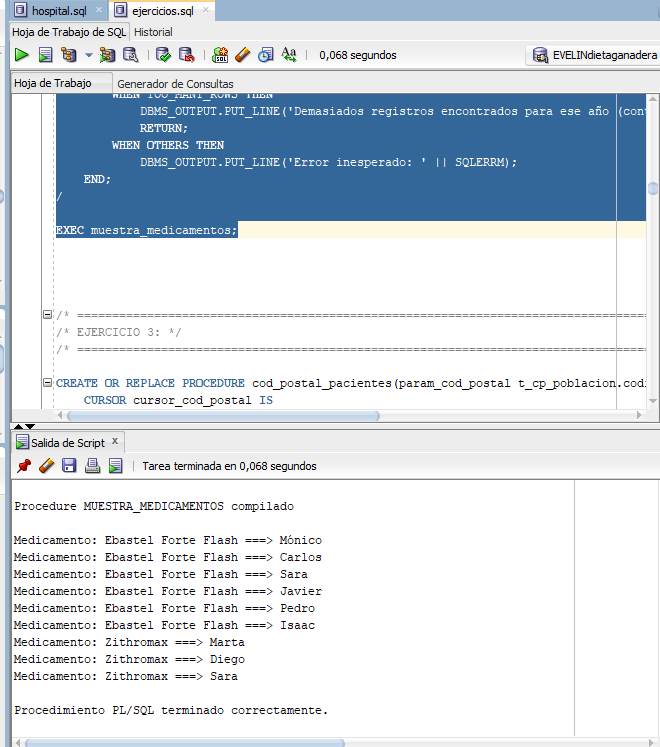
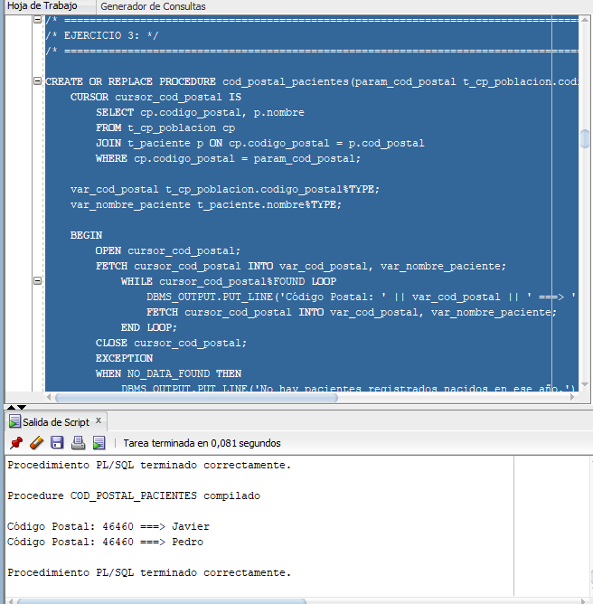
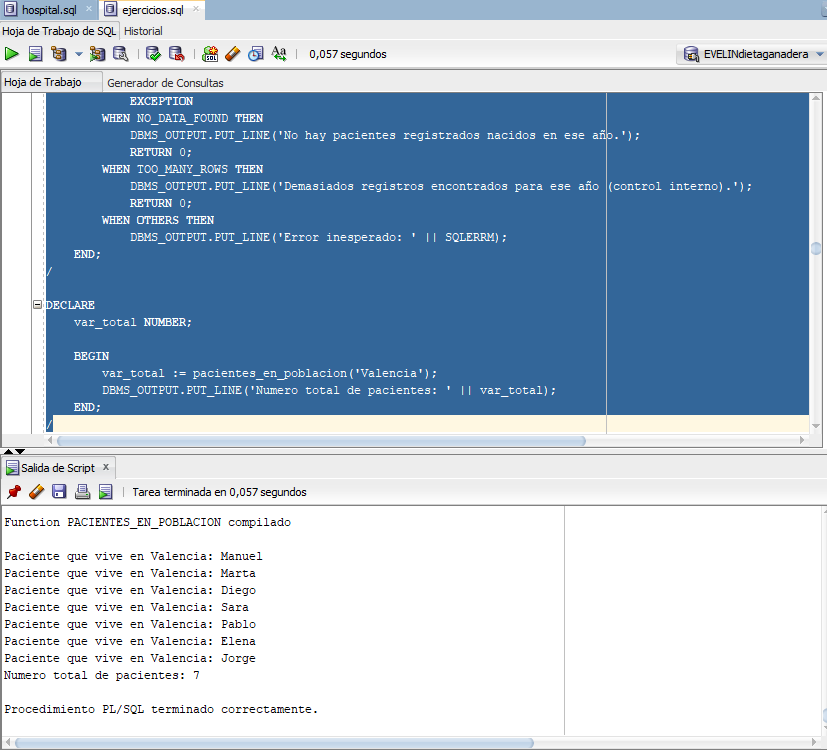
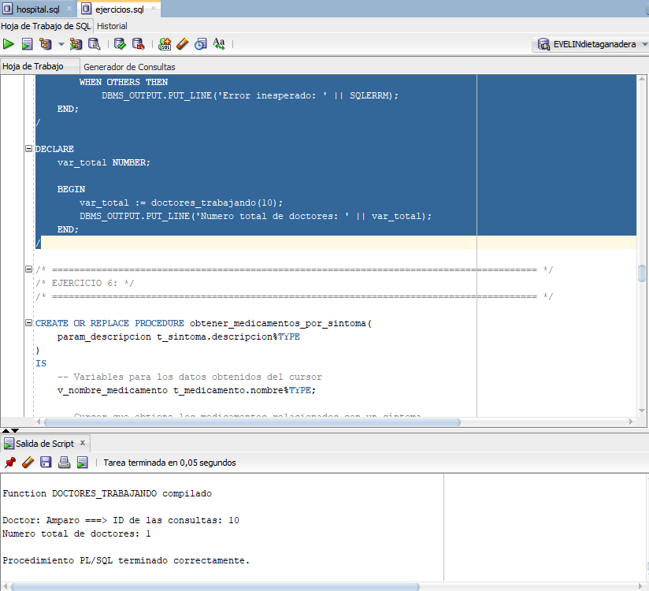
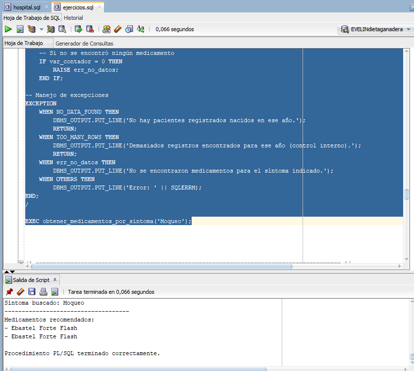
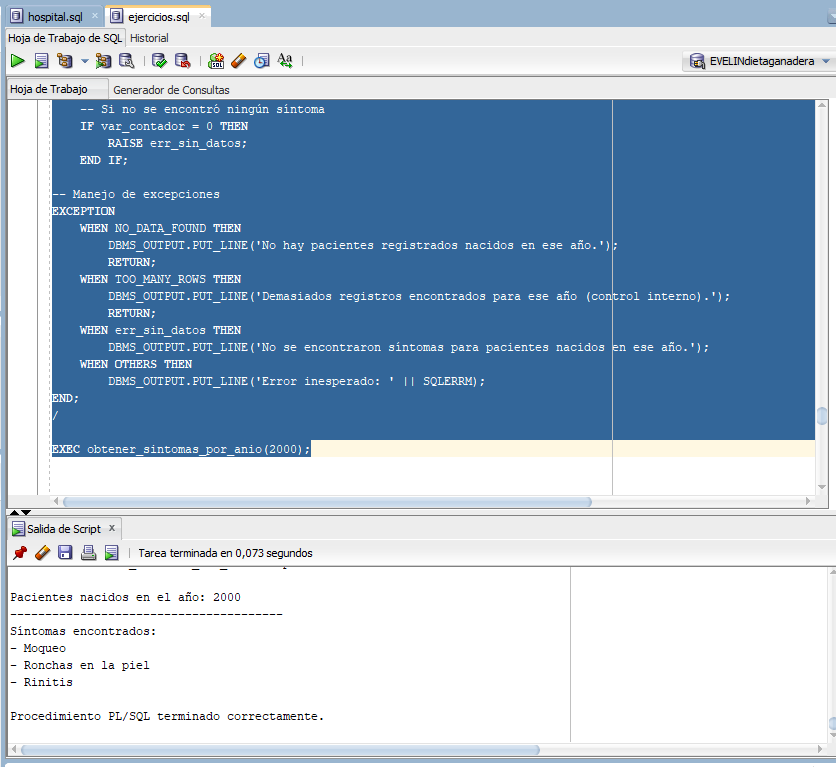
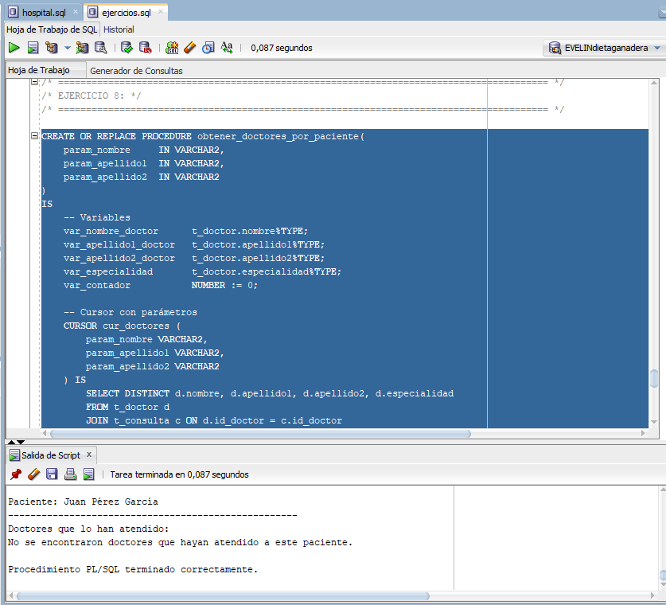

# PR1-1: Cursores, procedimientos y funciones

## ÍNDICE

1. [Preparativos](#preparativos)
2. [Ejercicio 1](#ejercicio-1)
3. [Ejercicio 2](#ejercicio-2)
4. [Ejercicio 3](#ejercicio-3)
5. [Ejercicio 4](#ejercicio-4)
6. [Ejercicio 5](#ejercicio-5)
7. [Ejercicio 6](#ejercicio-6)
8. [Ejercicio 7](#ejercicio-7)
9. [Ejercicio 8](#ejercicio-8)

<br/>

## Preparativos

Para asegurarnos de que todas las ejecuciones nos devolverá una respuesta en texto, tendremos que ejecutar las siguientes línea de comandos:

```sql
SET SERVEROUTPUT ON;
BEGIN
    DBMS_OUTPUT.PUT_LINE('Texto de prueba');
END;
/
```

De esta manera comprobamos que funcione:




## Ejercicio 1

**Este primer ejercicio es un ejemplo con el bucle FOR, mas adelante se hará lo mismo con un WHILE.**

```sql
/* ======================================================================================== */
/* EJERCICIO 1 VERDADERO */
/* ======================================================================================== */


CREATE OR REPLACE PROCEDURE muestra_paciente(v_nombre t_doctor.nombre%TYPE, v_apellido1 t_doctor.apellido1%TYPE, v_apellido2 t_doctor.apellido2%TYPE) IS

/* El CURSOR va linea por linea consultando el select y extrae la información */
CURSOR cpacientes IS
   SELECT DISTINCT p.id_paciente, p.nombre,p. apellido1, p.apellido2
       FROM t_paciente p  INNER JOIN t_consulta c 
          ON p.id_paciente = c.id_paciente 
               INNER JOIN t_doctor d 
                  ON c.id_doctor = d.id_doctor
                      WHERE UPPER(d.nombre) = UPPER(v_nombre) and UPPER(d.apellido1) = UPPER(v_apellido1) and UPPER(d.apellido2) = UPPER(v_apellido2);
                      
/* Aqui definimos las variables */
c_id_paciente t_paciente.id_paciente %TYPE;
c_nom_paciente t_paciente.nombre%TYPE;
c_ape1_paciente t_paciente.apellido1%TYPE;
c_ape2_paciente t_paciente.apellido2%TYPE;

BEGIN
  OPEN cpacientes;
   LOOP
    FETCH cpacientes INTO c_id_paciente, c_nom_paciente,c_ape1_paciente, c_ape2_paciente;
    EXIT WHEN cpacientes%NOTFOUND;
    DBMS_OUTPUT.PUT_LINE('Paciente: '  ||' ' || c_nom_paciente ||' ' || c_ape1_paciente ||' ' || c_ape2_paciente);
   END LOOP;
  CLOSE cpacientes;
  EXCEPTION
    WHEN NO_DATA_FOUND THEN
        DBMS_OUTPUT.PUT_LINE('No hay pacientes registrados nacidos en ese año.');
        RETURN;
    WHEN TOO_MANY_ROWS THEN
        DBMS_OUTPUT.PUT_LINE('Demasiados registros encontrados para ese año (control interno).');
        RETURN;
    WHEN OTHERS THEN
        DBMS_OUTPUT.PUT_LINE('Error inesperado: ' || SQLERRM);
END;
/

EXEC muestra_paciente('Amparo', 'Domingo', 'Hernández');
```



Ahora lo mismo pero con un bucle **WHILE**:

```sql
/* LO INTENTO HACER YO */
CREATE OR REPLACE PROCEDURE muestra_paciente(v_nombre t_doctor.nombre%TYPE, v_apellido1 t_doctor.apellido1%TYPE, v_apellido2 t_doctor.apellido2%TYPE) IS
    CURSOR prueba IS
        SELECT DISTINCT p.nombre, p.apellido1, p.apellido2
        FROM t_paciente p
        JOIN t_consulta c ON p.id_paciente = c.id_paciente
        JOIN t_doctor d ON c.id_doctor = d.id_doctor
        WHERE UPPER(v_nombre) = UPPER(d.nombre) and UPPER(v_apellido1) = UPPER(d.apellido1) and UPPER(v_apellido2) = UPPER(d.apellido2);

    pnombre t_paciente.nombre%TYPE;
    papellido1 t_paciente.apellido1%TYPE;
    papellido2 t_paciente.apellido2%TYPE;

    BEGIN
        OPEN prueba;
        
        FETCH prueba INTO pnombre, papellido1, papellido2;
        
        WHILE prueba%FOUND LOOP
            DBMS_OUTPUT.PUT_LINE('Paciente: ' || pnombre || ' ' || papellido1 || ' ' || papellido2);
            FETCH prueba INTO pnombre, papellido1, papellido2;
        END LOOP;
        
        CLOSE prueba;
        EXCEPTION
        WHEN NO_DATA_FOUND THEN
            DBMS_OUTPUT.PUT_LINE('No hay pacientes registrados nacidos en ese año.');
            RETURN;
        WHEN TOO_MANY_ROWS THEN
            DBMS_OUTPUT.PUT_LINE('Demasiados registros encontrados para ese año (control interno).');
            RETURN;
        WHEN OTHERS THEN
            DBMS_OUTPUT.PUT_LINE('Error inesperado: ' || SQLERRM);
    END;
/

EXEC muestra_paciente('Amparo', 'Domingo', 'Hernández');
```




## Ejercicio 2

El **EJERCICIO 2** consta del siguiente código:

```sql
/* ======================================================================================== */
/* EJERCICIO 2: */
/* ======================================================================================== */

CREATE OR REPLACE PROCEDURE muestra_medicamentos IS
    CURSOR cursor_medicamentos IS
        SELECT p.nombre, m.nombre
        FROM t_paciente p
        JOIN t_paciente_medicamento_tratamiento pmt ON p.id_paciente = pmt.id_paciente
        JOIN t_medicamento m ON pmt.id_medicamento = m.id_medicamento;

    paciente_nombre t_paciente.nombre%TYPE;
    paciente_medicamento t_medicamento.nombre%TYPE;
    
    BEGIN
        OPEN cursor_medicamentos;
            FETCH cursor_medicamentos INTO paciente_nombre, paciente_medicamento;
            WHILE cursor_medicamentos%FOUND LOOP
                DBMS_OUTPUT.PUT_LINE('Medicamento: ' || paciente_medicamento || ' ===> ' || paciente_nombre);
                FETCH cursor_medicamentos INTO paciente_nombre, paciente_medicamento;
            END LOOP;
        CLOSE cursor_medicamentos;
        EXCEPTION
        WHEN NO_DATA_FOUND THEN
            DBMS_OUTPUT.PUT_LINE('No hay pacientes registrados nacidos en ese año.');
            RETURN;
        WHEN TOO_MANY_ROWS THEN
            DBMS_OUTPUT.PUT_LINE('Demasiados registros encontrados para ese año (control interno).');
            RETURN;
        WHEN OTHERS THEN
            DBMS_OUTPUT.PUT_LINE('Error inesperado: ' || SQLERRM);
    END;
/

EXEC muestra_medicamentos;
```




## Ejercicio 3

El **EJERCICIO 3** consta del siguiente código:

```sql
/* ======================================================================================== */
/* EJERCICIO 3: */
/* ======================================================================================== */

CREATE OR REPLACE PROCEDURE cod_postal_pacientes(param_cod_postal t_cp_poblacion.codigo_postal%TYPE) IS
    CURSOR cursor_cod_postal IS
        SELECT cp.codigo_postal, p.nombre
        FROM t_cp_poblacion cp
        JOIN t_paciente p ON cp.codigo_postal = p.cod_postal
        WHERE cp.codigo_postal = param_cod_postal;
    
    var_cod_postal t_cp_poblacion.codigo_postal%TYPE;
    var_nombre_paciente t_paciente.nombre%TYPE;
    
    BEGIN
        OPEN cursor_cod_postal;
        FETCH cursor_cod_postal INTO var_cod_postal, var_nombre_paciente;
            WHILE cursor_cod_postal%FOUND LOOP
                DBMS_OUTPUT.PUT_LINE('Código Postal: ' || var_cod_postal || ' ===> ' || var_nombre_paciente);
                FETCH cursor_cod_postal INTO var_cod_postal, var_nombre_paciente;
            END LOOP;
        CLOSE cursor_cod_postal;
        EXCEPTION
        WHEN NO_DATA_FOUND THEN
            DBMS_OUTPUT.PUT_LINE('No hay pacientes registrados nacidos en ese año.');
            RETURN;
        WHEN TOO_MANY_ROWS THEN
            DBMS_OUTPUT.PUT_LINE('Demasiados registros encontrados para ese año (control interno).');
            RETURN;
        WHEN OTHERS THEN
            DBMS_OUTPUT.PUT_LINE('Error inesperado: ' || SQLERRM);
    END;
/

EXEC cod_postal_pacientes(46460);
```




## Ejercicio 4

El **EJERCICIO 4** consta del siguiente código:

```sql
/* ======================================================================================== */
/* EJERCICIO 4: */
/* ======================================================================================== */

CREATE OR REPLACE FUNCTION pacientes_en_poblacion(param_nombre_poblacion t_cp_poblacion.poblacion%TYPE) RETURN NUMBER IS
    CURSOR cursor_pacientes_poblacion IS
        SELECT cp.poblacion, p.nombre
        FROM t_cp_poblacion cp
        JOIN t_paciente p ON cp.codigo_postal = p.cod_postal
        WHERE UPPER(param_nombre_poblacion) = UPPER(cp.poblacion);
        
    var_poblacion t_cp_poblacion.poblacion%TYPE;
    var_nombre t_paciente.nombre%TYPE;
    var_contador NUMBER := 0;
    
    BEGIN
        OPEN cursor_pacientes_poblacion;
            LOOP
                FETCH cursor_pacientes_poblacion INTO var_poblacion, var_nombre;
                EXIT WHEN cursor_pacientes_poblacion%NOTFOUND;
                
                var_contador := var_contador + 1;
                DBMS_OUTPUT.PUT_LINE('Paciente que vive en ' || var_poblacion || ': ' || var_nombre);
            END LOOP;
        CLOSE cursor_pacientes_poblacion;
        RETURN var_contador;
            EXCEPTION
        WHEN NO_DATA_FOUND THEN
            DBMS_OUTPUT.PUT_LINE('No hay pacientes registrados nacidos en ese año.');
            RETURN 0;
        WHEN TOO_MANY_ROWS THEN
            DBMS_OUTPUT.PUT_LINE('Demasiados registros encontrados para ese año (control interno).');
            RETURN 0;
        WHEN OTHERS THEN
            DBMS_OUTPUT.PUT_LINE('Error inesperado: ' || SQLERRM);
    END;
/
    
DECLARE
    var_total NUMBER;
    
    BEGIN
        var_total := pacientes_en_poblacion('Valencia');
        DBMS_OUTPUT.PUT_LINE('Numero total de pacientes: ' || var_total);
    END;
/
```




## Ejercicio 5

El **EJERCICIO 5** consta del siguiente código:

```sql
/* ======================================================================================== */
/* EJERCICIO 5: */
/* ======================================================================================== */

CREATE OR REPLACE FUNCTION doctores_trabajando(param_id_consulta t_consulta.id_consulta%TYPE) RETURN NUMBER IS
    CURSOR cursor_idconsulta IS
        SELECT d.nombre, c.id_consulta
        FROM t_doctor d
        JOIN t_consulta c ON d.id_doctor = c.id_doctor
        WHERE param_id_consulta = c.id_consulta;
        
    var_id_consulta t_consulta.id_consulta%TYPE;
    var_nombre t_doctor.nombre%TYPE;
    var_contador NUMBER := 0;
        
    BEGIN
        OPEN cursor_idconsulta;
            LOOP
                FETCH cursor_idconsulta INTO var_nombre, var_id_consulta;
                EXIT WHEN cursor_idconsulta%NOTFOUND;
                
                var_contador := var_contador +1;
                DBMS_OUTPUT.PUT_LINE('Doctor: ' || var_nombre || ' ===> ' || 'ID de las consultas: ' || var_id_consulta);
            END LOOP;
        CLOSE cursor_idconsulta;
        RETURN var_contador;
        EXCEPTION
        WHEN NO_DATA_FOUND THEN
            DBMS_OUTPUT.PUT_LINE('No hay pacientes registrados nacidos en ese año.');
            RETURN 0;
        WHEN TOO_MANY_ROWS THEN
            DBMS_OUTPUT.PUT_LINE('Demasiados registros encontrados para ese año (control interno).');
            RETURN 0;
        WHEN OTHERS THEN
            DBMS_OUTPUT.PUT_LINE('Error inesperado: ' || SQLERRM);
    END;
/

DECLARE
    var_total NUMBER;
    
    BEGIN
        var_total := doctores_trabajando(10);
        DBMS_OUTPUT.PUT_LINE('Numero total de doctores: ' || var_total);
    END;
/
```




## Ejercicio 6

El **EJERCICIO 6** consta del siguiente código:

```sql
/* ======================================================================================== */
/* EJERCICIO 6: */
/* ======================================================================================== */

CREATE OR REPLACE PROCEDURE obtener_medicamentos_por_sintoma(
    param_descripcion t_sintoma.descripcion%TYPE
)
IS
    -- Variables para los datos obtenidos del cursor
    v_nombre_medicamento t_medicamento.nombre%TYPE;

    -- Cursor que obtiene los medicamentos relacionados con un síntoma
    CURSOR cur_medicamentos IS
        SELECT m.nombre
        FROM t_medicamento m
        JOIN t_medicamento_sintoma ms ON m.id_medicamento = ms.id_medicamento
        JOIN t_sintoma s ON s.id_sintoma = ms.id_sintoma
        WHERE LOWER(s.descripcion) LIKE '%' || LOWER(param_descripcion) || '%';

    -- Excepción personalizada
    err_no_datos EXCEPTION;
    var_contador NUMBER := 0;

BEGIN
    DBMS_OUTPUT.PUT_LINE('Síntoma buscado: ' || param_descripcion);
    DBMS_OUTPUT.PUT_LINE('------------------------------------');
    DBMS_OUTPUT.PUT_LINE('Medicamentos recomendados:');

    -- Abrir cursor y recorrer resultados
    FOR reg IN cur_medicamentos LOOP
        DBMS_OUTPUT.PUT_LINE('- ' || reg.nombre);
        var_contador := var_contador + 1;
    END LOOP;

    -- Si no se encontró ningún medicamento
    IF var_contador = 0 THEN
        RAISE err_no_datos;
    END IF;

-- Manejo de excepciones
EXCEPTION
    WHEN NO_DATA_FOUND THEN
        DBMS_OUTPUT.PUT_LINE('No hay pacientes registrados nacidos en ese año.');
        RETURN;
    WHEN TOO_MANY_ROWS THEN
        DBMS_OUTPUT.PUT_LINE('Demasiados registros encontrados para ese año (control interno).');
        RETURN;
    WHEN err_no_datos THEN
        DBMS_OUTPUT.PUT_LINE('No se encontraron medicamentos para el síntoma indicado.');
    WHEN OTHERS THEN
        DBMS_OUTPUT.PUT_LINE('Error: ' || SQLERRM);
END;
/

EXEC obtener_medicamentos_por_sintoma('Moqueo');
```




## Ejercicio 7

El **EJERCICIO 7** consta del siguiente código:

```sql
/* ======================================================================================== */
/* EJERCICIO 7: */
/* ======================================================================================== */

CREATE OR REPLACE PROCEDURE obtener_sintomas_por_anio(
    param_anio IN NUMBER
)
IS
    -- Variables
    var_descripcion_sintoma t_sintoma.descripcion%TYPE;
    var_contador NUMBER := 0;

    -- Cursor con parámetro (año de nacimiento)
    CURSOR cur_sintomas (param_anio NUMBER) IS
        SELECT s.descripcion
        FROM t_sintoma s
        JOIN t_diagnostico d ON s.id_diagnostico = d.id_diagnostico
        JOIN t_consulta c ON d.consulta_id = c.id_consulta
        JOIN t_paciente p ON c.id_paciente = p.id_paciente
        WHERE EXTRACT(YEAR FROM p.f_nacimiento) = param_anio;

    -- Excepciones
    err_sin_datos EXCEPTION;

BEGIN
    DBMS_OUTPUT.PUT_LINE('Pacientes nacidos en el año: ' || param_anio);
    DBMS_OUTPUT.PUT_LINE('---------------------------------------');
    DBMS_OUTPUT.PUT_LINE('Síntomas encontrados:');

    -- Recorremos los resultados del cursor
    FOR reg IN cur_sintomas(param_anio) LOOP
        var_contador := var_contador + 1;
        DBMS_OUTPUT.PUT_LINE('- ' || reg.descripcion);
    END LOOP;

    -- Si no se encontró ningún síntoma
    IF var_contador = 0 THEN
        RAISE err_sin_datos;
    END IF;

-- Manejo de excepciones
EXCEPTION
    WHEN NO_DATA_FOUND THEN
        DBMS_OUTPUT.PUT_LINE('No hay pacientes registrados nacidos en ese año.');
        RETURN;
    WHEN TOO_MANY_ROWS THEN
        DBMS_OUTPUT.PUT_LINE('Demasiados registros encontrados para ese año (control interno).');
        RETURN;
    WHEN err_sin_datos THEN
        DBMS_OUTPUT.PUT_LINE('No se encontraron síntomas para pacientes nacidos en ese año.');
    WHEN OTHERS THEN
        DBMS_OUTPUT.PUT_LINE('Error inesperado: ' || SQLERRM);
END;
/

EXEC obtener_sintomas_por_anio(2000);
```




## Ejercicio 8

El **EJERCICIO 8** consta del siguiente código:

```sql
/* ======================================================================================== */
/* EJERCICIO 8: */
/* ======================================================================================== */

CREATE OR REPLACE PROCEDURE obtener_doctores_por_paciente(
    param_nombre     IN VARCHAR2,
    param_apellido1  IN VARCHAR2,
    param_apellido2  IN VARCHAR2
)
IS
    -- Variables
    var_nombre_doctor      t_doctor.nombre%TYPE;
    var_apellido1_doctor   t_doctor.apellido1%TYPE;
    var_apellido2_doctor   t_doctor.apellido2%TYPE;
    var_especialidad       t_doctor.especialidad%TYPE;
    var_contador           NUMBER := 0;

    -- Cursor con parámetros
    CURSOR cur_doctores (
        param_nombre VARCHAR2,
        param_apellido1 VARCHAR2,
        param_apellido2 VARCHAR2
    ) IS
        SELECT DISTINCT d.nombre, d.apellido1, d.apellido2, d.especialidad
        FROM t_doctor d
        JOIN t_consulta c ON d.id_doctor = c.id_doctor
        JOIN t_paciente p ON c.id_paciente = p.id_paciente
        WHERE LOWER(p.nombre) = LOWER(param_nombre)
          AND LOWER(p.apellido1) = LOWER(param_apellido1)
          AND LOWER(p.apellido2) = LOWER(param_apellido2);

    -- Excepción personalizada
    err_sin_datos EXCEPTION;

BEGIN
    DBMS_OUTPUT.PUT_LINE('Paciente: ' || param_nombre || ' ' || param_apellido1 || ' ' || param_apellido2);
    DBMS_OUTPUT.PUT_LINE('----------------------------------------------------');
    DBMS_OUTPUT.PUT_LINE('Doctores que lo han atendido:');

    -- Recorremos el cursor
    FOR reg IN cur_doctores(param_nombre, param_apellido1, param_apellido2) LOOP
        var_contador := var_contador + 1;
        DBMS_OUTPUT.PUT_LINE('- ' || reg.nombre || ' ' || reg.apellido1 || ' ' || reg.apellido2 || 
                             ' | Especialidad: ' || reg.especialidad);
    END LOOP;

    -- Si no hay resultados
    IF var_contador = 0 THEN
        RAISE err_sin_datos;
    END IF;

-- Manejo de excepciones
EXCEPTION
    WHEN NO_DATA_FOUND THEN
        DBMS_OUTPUT.PUT_LINE('No hay pacientes registrados nacidos en ese año.');
        RETURN;
    WHEN TOO_MANY_ROWS THEN
        DBMS_OUTPUT.PUT_LINE('Demasiados registros encontrados para ese año (control interno).');
        RETURN;
    WHEN err_sin_datos THEN
        DBMS_OUTPUT.PUT_LINE('No se encontraron doctores que hayan atendido a este paciente.');
    WHEN OTHERS THEN
        DBMS_OUTPUT.PUT_LINE('Error inesperado: ' || SQLERRM);
END;
/

EXEC obtener_doctores_por_paciente('Juan', 'Pérez', 'García');
```

