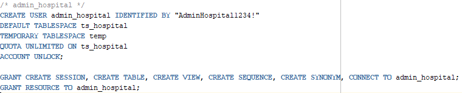
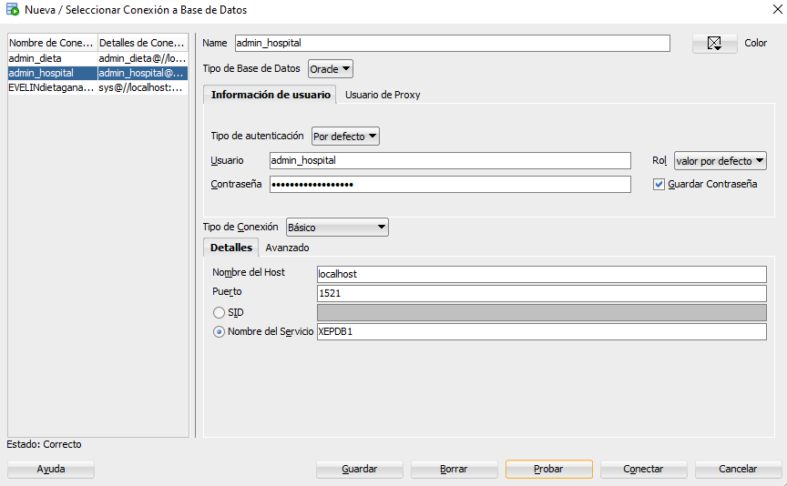
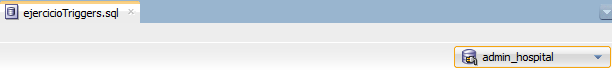
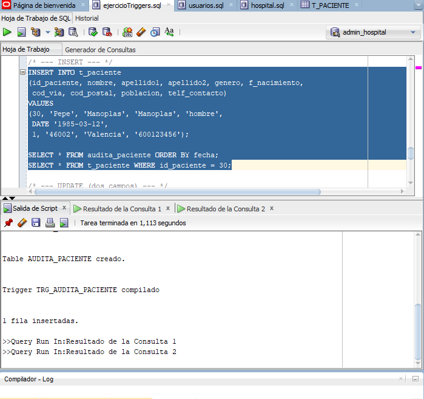
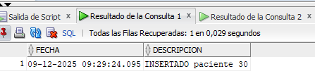
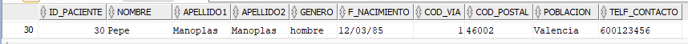
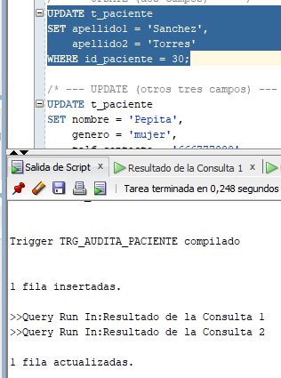
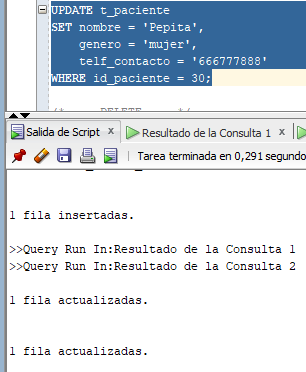
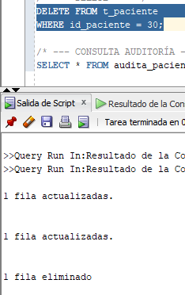
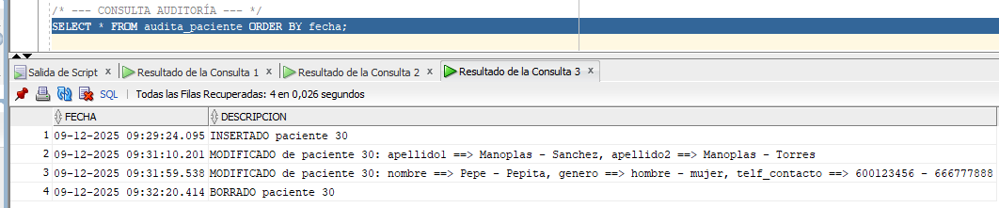

# PR2-RA04: Disparador multi evento sobre la tabla t_paciente

## ÍNDICE

1. [Preparativos](#preparativos)
2. [Tabla auditoría](#tabla-auditoría)
3. [Comprobaciones](#comprobaciones)


## Preparativos

Para hacereste ejercicio tendremos que crear un trigger para auditar todos los cambios de la tabla `t_paciente` . Como estamos utilizando una tabla perteneciente a la "db" de **Hospital**, tendremos que seguir los procedimientos con un usuario administrador de esa "db", y no con el usuario `sys` .

Por ello crearemos `admin_hospital` de la siguiente manera:





En un nuevo fichero donde vayamos a hacer el trigger, nos aseguramos de que esté asignado al usuario correcto:




## Tabla auditoría

Este sería el código para crear la tabla auditoría y registrar los cambios de t_paciente. A continuación se explicará cada cosa lo que hace:

```sql
/* ============================================================
   -------------------  TABLA DE AUDITORÍA  -------------------
   ============================================================ */

/* Se crea una tabla para registrar eventos (insert, update, delete)
   ocurridos sobre la tabla t_paciente. */
CREATE TABLE audita_paciente (
    fecha       VARCHAR2(40) PRIMARY KEY,  -- Fecha del evento (con milisegundos)
    descripcion VARCHAR2(1000)             -- Texto descriptivo del cambio
);


/* Borrado de la tabla (normalmente usado en pruebas) */
DROP TABLE audita_paciente;


/* ============================================================
   ---------------     TRIGGER MULTIEVENTO    -----------------
   ============================================================ */

/* Nota aclaratoria: este disparador actuará para INSERT, UPDATE y DELETE */
AFTER INSERT OR UPDATE OR DELETE ON t_paciente


/* ============================================================
   -------------   TRIGGER COMPLETO DE AUDITORÍA  -------------
   ============================================================ */

CREATE OR REPLACE TRIGGER trg_audita_paciente
AFTER INSERT OR UPDATE OR DELETE ON t_paciente   -- Se ejecuta después del cambio
FOR EACH ROW                                     -- Se ejecuta por cada fila afectada
DECLARE
    v_fecha   VARCHAR2(23);                      -- Guardará la fecha del evento
    v_cambios VARCHAR2(4000) := '';              -- Acumula los cambios en un UPDATE
BEGIN

    -- Generar fecha única con milisegundos para evitar duplicados
    v_fecha := TO_CHAR(SYSTIMESTAMP, 'DD-MM-YYYY HH24:MI:SS.FF3');


    /* ============================
       --------   INSERT   --------
       ============================ */
    IF INSERTING THEN
        INSERT INTO audita_paciente VALUES
        (v_fecha,
         'INSERTADO paciente ' || :NEW.id_paciente);


    /* ============================
       --------   DELETE   --------
       ============================ */
    ELSIF DELETING THEN
        INSERT INTO audita_paciente VALUES
        (v_fecha,
         'BORRADO paciente ' || :OLD.id_paciente);


    /* ============================
       --------   UPDATE   --------
       ============================ */
    ELSIF UPDATING THEN

        /* Se compara campo por campo para detectar qué ha cambiado.
           NVL se usa para evitar que valores NULL causen problemas. */

        -- Cambio en nombre
        IF NVL(:OLD.nombre,'-') <> NVL(:NEW.nombre,'-') THEN
            v_cambios := v_cambios ||
                         'nombre ==> ' ||
                         NVL(:OLD.nombre,'NULL') || ' - ' ||
                         NVL(:NEW.nombre,'NULL') || ', ';
        END IF;

        -- Cambio en apellido1
        IF NVL(:OLD.apellido1,'-') <> NVL(:NEW.apellido1,'-') THEN
            v_cambios := v_cambios ||
                         'apellido1 ==> ' ||
                         NVL(:OLD.apellido1,'NULL') || ' - ' ||
                         NVL(:NEW.apellido1,'NULL') || ', ';
        END IF;

        -- Cambio en apellido2
        IF NVL(:OLD.apellido2,'-') <> NVL(:NEW.apellido2,'-') THEN
            v_cambios := v_cambios ||
                         'apellido2 ==> ' ||
                         NVL(:OLD.apellido2,'NULL') || ' - ' ||
                         NVL(:NEW.apellido2,'NULL') || ', ';
        END IF;

        -- Cambio en género
        IF NVL(:OLD.genero,'-') <> NVL(:NEW.genero,'-') THEN
            v_cambios := v_cambios ||
                         'genero ==> ' ||
                         NVL(:OLD.genero,'NULL') || ' - ' ||
                         NVL(:NEW.genero,'NULL') || ', ';
        END IF;

        -- Cambio en código de vía
        IF NVL(:OLD.cod_via,-1) <> NVL(:NEW.cod_via,-1) THEN
            v_cambios := v_cambios ||
                         'cod_via ==> ' ||
                         NVL(TO_CHAR(:OLD.cod_via),'NULL') || ' - ' ||
                         NVL(TO_CHAR(:NEW.cod_via),'NULL') || ', ';
        END IF;

        -- Cambio en código postal
        IF NVL(:OLD.cod_postal,'-') <> NVL(:NEW.cod_postal,'-') THEN
            v_cambios := v_cambios ||
                         'cod_postal ==> ' ||
                         NVL(:OLD.cod_postal,'NULL') || ' - ' ||
                         NVL(:NEW.cod_postal,'NULL') || ', ';
        END IF;

        -- Cambio en teléfono de contacto
        IF NVL(:OLD.telf_contacto,'-') <> NVL(:NEW.telf_contacto,'-') THEN
            v_cambios := v_cambios ||
                         'telf_contacto ==> ' ||
                         NVL(:OLD.telf_contacto,'NULL') ||
                         ' - ' || NVL(:NEW.telf_contacto,'NULL') || ', ';
        END IF;

        -- Eliminar la última coma sobrante del texto de cambios
        v_cambios := RTRIM(v_cambios, ', ');

        -- Registrar en la auditoría el conjunto de cambios
        INSERT INTO audita_paciente VALUES
        (v_fecha,
         'MODIFICADO paciente ' || :NEW.id_paciente || ': ' || v_cambios);

    END IF;

END;
/
```

## Comprobaciones

Ahora vamos paso por paso comprobando el funcionamiento. En las capturas se verá estas líneas de código vitales para comprobar el correcto funcionamiento de nuestro trigger:

```sql
/* === PRUEBAS === */
/* --- INSERT --- */
INSERT INTO t_paciente
(id_paciente, nombre, apellido1, apellido2, genero, f_nacimiento,
 cod_via, cod_postal, poblacion, telf_contacto)
VALUES
(30, 'Pepe', 'Manoplas', 'Manoplas', 'hombre',
 DATE '1985-03-12', 
 1, '46002', 'Valencia', '600123456');

SELECT * FROM audita_paciente ORDER BY fecha;
SELECT * FROM t_paciente WHERE id_paciente = 30;

/* --- UPDATE (dos campos) --- */
UPDATE t_paciente
SET apellido1 = 'Sanchez',
    apellido2 = 'Torres'
WHERE id_paciente = 30;

/* --- UPDATE (otros tres campos) --- */
UPDATE t_paciente
SET nombre = 'Pepita',
    genero = 'mujer',
    telf_contacto = '666777888'
WHERE id_paciente = 30;

/* --- DELETE --- */
DELETE FROM t_paciente
WHERE id_paciente = 30;

/* --- CONSULTA AUDITORÍA --- */
SELECT * FROM audita_paciente ORDER BY fecha;
```

Una vez creada la tabla de auditoría y el trigger, probaremos a insertar nuevos datos en nuestra tabla `t_pacientes` para ver si lo registra.



Vemos que efectivamente lo registra en nuestra tabla de auditoría:



Además de que obviamente añade una nueva fila en `t_pacientes`:



Continuamos las pruebas actualizando la fila que acabábamos de insertar:



Lo actualizaremos otra vez pero esta vez añadiendo otro parámetro adicional:



Finalmente borramos la fila creada:



Si mostramos la información de nuestra tabla de auditoría, podremos ver que efectivamente se han registrado todos los cambios, tal como los hemos hecho anteriormente.

