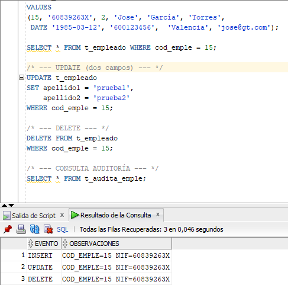
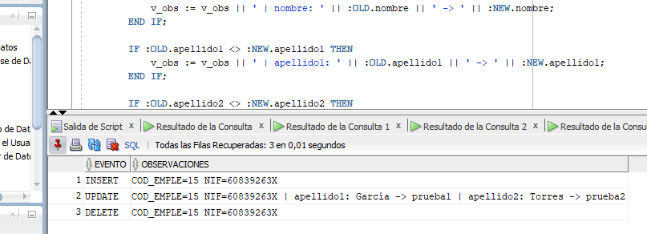
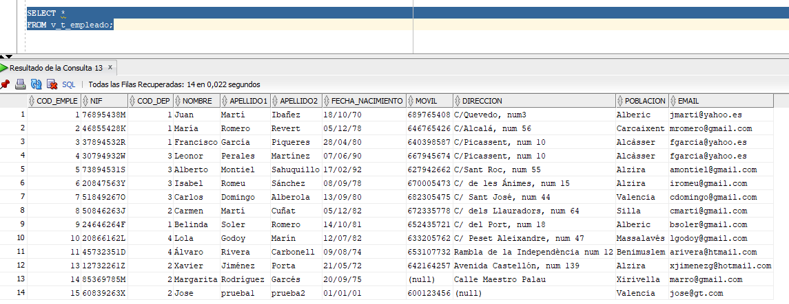

# PR2-RA04: Disparadores Empresa

## ÍNDICE

1. [Preparativos](#preparativos)
2. [Actividad 1](#actividad-1)
3. [Comprobaciones](#comprobaciones-ejercicio-1)
4. [Actividad 2](#actividad-2)
5. [Comprobaciones](#comprobaciones-ejercicio-2)
6. [Actividad 3](#actividad-3)
7. [Comprobaciones](#comprobaciones-ejercicio-3)


## Preparativos

Para hacer este ejercicio tendremos que crear un trigger para auditar todos los cambios de la tabla `t_empleado` . Como estamos utilizando una tabla perteneciente a la "db" de **Empresa**, tendremos que seguir los procedimientos con un usuario administrador de esa "db", y no con el usuario `sys` .

Por lo que para crear al administrador, desde el usuario `sys` ejecutaremos las siguientes líneas. Una vez ejecutado solo nos encargamos de realizar la conexión, crear las tablas con el usuario respectivo y a realizar los "triggers".
```sql
/* admin_empresa */
CREATE USER admin_empresa IDENTIFIED BY "AdminEmpresa1234!"
DEFAULT TABLESPACE ts_empresa
TEMPORARY TABLESPACE temp
QUOTA UNLIMITED ON ts_empresa
ACCOUNT UNLOCK;

GRANT CREATE SESSION, CREATE TABLE, CREATE VIEW, CREATE SEQUENCE, CREATE SYNONYM, CONNECT TO admin_empresa;
GRANT RESOURCE TO admin_empresa;

/* PARA ELIMINAR !!! */
DROP USER admin_empresa;

/* CREAMOS TAMBIÉN EL TABLESCPACE */
CREATE TABLESPACE ts_empresa
DATAFILE 'ts_empresa.dbf'
SIZE 100 M
AUTOEXTEND ON NEXT 10 M;
```


## Actividad 1

Crea una tabla `t_audita_emple` con dos campos: ***evento* y *observaciones***.
Crea un trigger que se dispare cuando se inserte, modifique o borre un registro en la tabla empleado, de manera que según el evento, se escriba un registro en la tabla `t_audita_emple`. En el campo `evento` se escribirá la acción que se ha realizado para que se dispare el trigger y en el campo `observaciones` se **escribirá el valor del código del *empleado* y el *nif***.

Este sería el código para crear la tabla auditoría y registrar los cambios de `t_empleado` .

```sql
/*
=================================
---------- ACTIVIDAD 1 ----------
=================================
*/

CREATE TABLE t_audita_emple (
    evento VARCHAR2(20),
    observaciones VARCHAR2(4000)
) TABLESPACE ts_empresa;

/* DROP TABLE t_audita_emple */
CREATE OR REPLACE TRIGGER trg_audita_empleado
AFTER INSERT OR UPDATE OR DELETE ON t_empleado
FOR EACH ROW
BEGIN
    IF INSERTING THEN
        INSERT INTO t_audita_emple (evento, observaciones)
        VALUES (
            'INSERT',
            'COD_EMPLE=' || :NEW.cod_emple || ' NIF=' || :NEW.nif
        );

    ELSIF UPDATING THEN
        INSERT INTO t_audita_emple (evento, observaciones)
        VALUES (
            'UPDATE',
            'COD_EMPLE=' || :NEW.cod_emple || ' NIF=' || :NEW.nif
        );

    ELSIF DELETING THEN
        INSERT INTO t_audita_emple (evento, observaciones)
        VALUES (
            'DELETE',
            'COD_EMPLE=' || :OLD.cod_emple || ' NIF=' || :OLD.nif
        );
    END IF;
END;
/
```

### Comprobaciones (Ejercicio 1)

Para comprobar el funcionamiento de nuestros Triggers, vamos a tener que hacer cambios en nuestra tabla `t_empleado` , por lo que nos basaremos siempre en las siguientes modificaciones:

```sql
/* === COMPROBACIONES === */
/* --- INSERT --- */
INSERT INTO t_empleado
(cod_emple, nif, cod_dep, nombre, apellido1, apellido2,
 fecha_nacimiento, movil, poblacion, email)
VALUES
(15, '60839263X', 2, 'Jose', 'García', 'Torres',
 DATE '1985-03-12', '600123456',  'Valencia', 'jose@gt.com');

SELECT * FROM t_empleado WHERE cod_emple = 15;

/* --- UPDATE (dos campos) --- */
UPDATE t_empleado
SET apellido1 = 'prueba1',
    apellido2 = 'prueba2'
WHERE cod_emple = 15;

/* --- DELETE --- */
DELETE FROM t_empleado
WHERE cod_emple = 15;

/* --- CONSULTA AUDITORÍA --- */
SELECT * FROM t_audita_emple;
```



**TODAS LAS CAPTURAS DE PANTALLAN SON EL RESULTADO DE LAS MISMAS COMPROBACIONES, LO UNICO QUE SE MODIFICA SON LOS TRIGGERS!!! (MENOS LA ÚLTIMA ACTIVIDAD, YA SE MUESTRA EN QUE HA CAMBIADO LA COMPROBACIÓN DE LA PROPIA ACTIVIDAD)**


## Actividad 2

A partir del ejercicio anterior, modifica el UPDATE para que además del código de empleado, muestre todos los campos que se hayan modificado. Desactiva el trigger anterior.

```sql
/*
=================================
---------- ACTIVIDAD 2 ----------
=================================
*/

ALTER TRIGGER trg_audita_empleado DISABLE;


CREATE OR REPLACE TRIGGER trg_audita_empleado
AFTER INSERT OR UPDATE OR DELETE ON t_empleado
FOR EACH ROW
DECLARE
    v_obs VARCHAR2(4000);
BEGIN
    IF INSERTING THEN
        INSERT INTO t_audita_emple (evento, observaciones)
        VALUES (
            'INSERT',
            'COD_EMPLE=' || :NEW.cod_emple || ' NIF=' || :NEW.nif
        );

    ELSIF UPDATING THEN
        v_obs := 'COD_EMPLE=' || :NEW.cod_emple || ' NIF=' || :NEW.nif;

        IF :OLD.nombre <> :NEW.nombre THEN
            v_obs := v_obs || ' | nombre: ' || :OLD.nombre || ' -> ' || :NEW.nombre;
        END IF;

        IF :OLD.apellido1 <> :NEW.apellido1 THEN
            v_obs := v_obs || ' | apellido1: ' || :OLD.apellido1 || ' -> ' || :NEW.apellido1;
        END IF;

        IF :OLD.apellido2 <> :NEW.apellido2 THEN
            v_obs := v_obs || ' | apellido2: ' || :OLD.apellido2 || ' -> ' || :NEW.apellido2;
        END IF;

        IF :OLD.cod_dep <> :NEW.cod_dep THEN
            v_obs := v_obs || ' | cod_dep: ' || :OLD.cod_dep || ' -> ' || :NEW.cod_dep;
        END IF;

        IF :OLD.fecha_nacimiento <> :NEW.fecha_nacimiento THEN
            v_obs := v_obs || ' | fecha_nacimiento: ' ||
                     TO_CHAR(:OLD.fecha_nacimiento,'DD/MM/YYYY') || ' -> ' ||
                     TO_CHAR(:NEW.fecha_nacimiento,'DD/MM/YYYY');
        END IF;

        IF NVL(:OLD.movil,'X') <> NVL(:NEW.movil,'X') THEN
            v_obs := v_obs || ' | movil: ' || :OLD.movil || ' -> ' || :NEW.movil;
        END IF;

        IF NVL(:OLD.direccion,'X') <> NVL(:NEW.direccion,'X') THEN
            v_obs := v_obs || ' | direccion: ' || :OLD.direccion || ' -> ' || :NEW.direccion;
        END IF;

        IF :OLD.poblacion <> :NEW.poblacion THEN
            v_obs := v_obs || ' | poblacion: ' || :OLD.poblacion || ' -> ' || :NEW.poblacion;
        END IF;

        IF NVL(:OLD.email,'X') <> NVL(:NEW.email,'X') THEN
            v_obs := v_obs || ' | email: ' || :OLD.email || ' -> ' || :NEW.email;
        END IF;

        INSERT INTO t_audita_emple (evento, observaciones)
        VALUES ('UPDATE', v_obs);

    ELSIF DELETING THEN
        INSERT INTO t_audita_emple (evento, observaciones)
        VALUES (
            'DELETE',
            'COD_EMPLE=' || :OLD.cod_emple || ' NIF=' || :OLD.nif
        );
    END IF;
END;
/
```

### Comprobaciones (Ejercicio 2)

Si ejecutamos el mismo código de comprobación que en el anterior ejercicio...




## Actividad 3

Crea un trigger de sustitución sobre la tabla `t_empleado` de manera que si se escribe una **fecha de nacimiento mayor** que la fecha actual, escriba una fecha **01/01/0001**. Crea una vista que se alimente de la tabla `t_empleado` , que se llame `v_t_empleado` . Deshabilita el trigger anterior.

```sql
/*
=================================
---------- ACTIVIDAD 3 ----------
=================================
*/

ALTER TRIGGER trg_audita_empleado DISABLE;


CREATE OR REPLACE TRIGGER trg_fecha_nacimiento
BEFORE INSERT OR UPDATE ON t_empleado
FOR EACH ROW
BEGIN
    IF :NEW.fecha_nacimiento > SYSDATE THEN
        :NEW.fecha_nacimiento := TO_DATE('01/01/0001','DD/MM/YYYY');
    END IF;
END;
/

/* Creamos una vista para poder visualizar la tabla "t_empleado" */
CREATE OR REPLACE VIEW v_t_empleado AS
SELECT *
FROM t_empleado;

/* Para ver la vista */
SELECT * 
FROM v_t_empleado;
```

### Comprobaciones (Ejercicio 3)

Para poder comprobar el correcto funcionamiento del Trigger, tendremos que cambiar la fecha al insertar los datos de nuestra comprobación:

```sql
/* === COMPROBACIONES === */
/* --- INSERT --- */
INSERT INTO t_empleado
(cod_emple, nif, cod_dep, nombre, apellido1, apellido2,
 fecha_nacimiento, movil, poblacion, email)
VALUES
(15, '60839263X', 2, 'Jose', 'García', 'Torres',
 DATE '3000-01-01', '600123456',  'Valencia', 'jose@gt.com');
```

Concretamente la siguiente línea.

De esto:

```sql
DATE '1985-03-12'
```

A esto:

```sql
DATE '3000-01-01'
```

Y ejecutando la vista podremos ver que se ha aplicado la regla definida sobre la insercción de la fecha.


